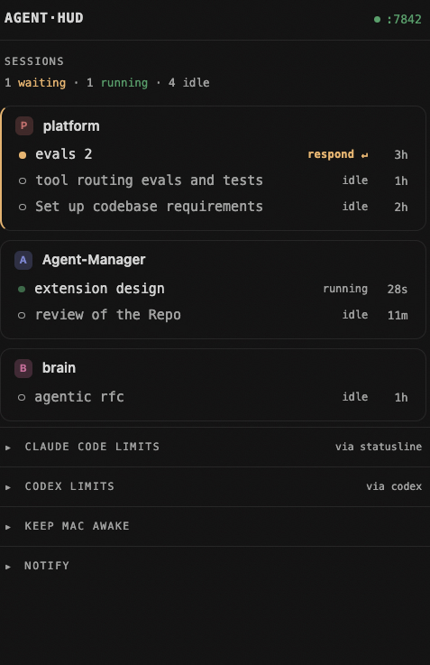
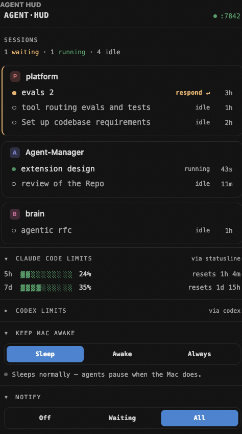

# Agent HUD

A lightweight, local macOS system that gives a glanceable view + control over running **Claude Code** agents. It does three things:

1. **Sessions** — which Claude Code agents are running, and crucially **which one needs you** (waiting on a permission prompt or a question).
2. **Keep-awake** — keep the Mac awake so agents keep running, including with the **lid closed**.
3. **Limits** — current 5-hour and 7-day Claude Code rate-limit usage.

It only *observes and toggles sleep* — it never spawns or owns the agents (you launch those from your editor/terminal as usual).

## Screenshots

<p align="center">
  
  &nbsp;&nbsp;
  
</p>

## Architecture

Three decoupled layers (see [`vision.md`](./vision.md) for the full spec):

```
Claude Code (hooks + statusLine)  ──▶  Daemon (localhost :7842)  ──▶  Cursor/VS Code sidebar view
   the control surface                  single source of truth         thin client (WS push)
```

- **`packages/daemon`** — Node + TypeScript + Fastify. Runs under `launchd`, owns sleep state (`caffeinate` + `pmset`), ingests Claude Code hook events into a session table, collects usage from the statusLine, and serves `/state` + a WebSocket `/events` stream.
- **`packages/vscode-extension`** — TypeScript Cursor/VS Code extension. A sidebar webview ("Console" design) + a status-bar item; a thin client of the daemon.

### Session states

`waiting` (blocked on a permission prompt or `AskUserQuestion`) · `ready` (finished a turn, your move) · `running` (working) · `idle` (untouched a while).

## Requirements

- **macOS** (uses `caffeinate`, `pmset`, `launchd`, `osascript`).
- **Node ≥ 20** (`node`/`npm` on `PATH`).
- **Cursor or VS Code**, with its shell command installed so `cursor` (or `code`)
  works in a terminal — in the editor: `Cmd+Shift+P → "Shell Command: Install
  'cursor'/'code' command in PATH"`. The extension installer needs it.
- **Claude Code ≥ v2.1.80** (for the `rate_limits` usage data). The hooks work on
  any recent version; only the Limits panel needs this.
- *Optional:* [`terminal-notifier`](https://github.com/julienXX/terminal-notifier)
  (`brew install terminal-notifier`) for **clickable** notifications that jump to
  the session. Without it, notifications fall back to a plain `osascript` banner.
- *Optional:* the [**Codex CLI**](https://developers.openai.com/codex) if you also
  want Codex sessions in the HUD (see [Codex](#codex-optional)).

## Install

> 🤖 **Installing with an AI coding agent? Use
> [`agentic-install.md`](./agentic-install.md).** It's a guided playbook that asks
> the setup questions up front and prompts + verifies every manual step in-flow,
> so nothing is left half-wired. Agents should follow it instead of the quick
> steps below.

Humans: one command does everything — prerequisite checks, daemon + hooks, and the
editor extension. Either bootstrap remotely:

```bash
curl -fsSL https://raw.githubusercontent.com/hfarazul/Agent-Manager/main/bootstrap.sh | bash
# then reload the editor: Cmd+Shift+P → "Developer: Reload Window"
```

…or clone and run it yourself:

```bash
git clone https://github.com/hfarazul/Agent-Manager.git
cd Agent-Manager
./install.sh
```

It's idempotent — re-run it after `git pull` to update. Under the hood it runs
`setup/install.sh` (daemon + hooks) then builds and installs the extension; you
can run those two steps individually if you prefer.

### Installing for someone (agent-friendly)

If you're a coding agent (e.g. Claude Code) setting this up for a user, follow
**[`agentic-install.md`](./agentic-install.md)** — a guided playbook that asks the
setup questions up front and walks each manual step in-flow (instead of leaving
them as a skippable end-list). In short: run the install, then **verify each
layer** rather than assuming success:

```bash
# 1. Install (idempotent, ~1–2 min: builds the daemon + the extension)
./install.sh

# 2. Verify the daemon is up
curl -s --max-time 2 http://localhost:7842/health        # → {"ok":true,...}
launchctl print "gui/$(id -u)/com.agent-hud.daemon" >/dev/null 2>&1 && echo "service loaded"

# 3. Verify the hooks are wired
grep -q "hook.mjs" ~/.claude/settings.json && echo "claude hooks ok"
[ -f ~/.codex/config.toml ] && grep -q "hook.mjs codex" ~/.codex/config.toml && echo "codex hooks ok"

# 4. Verify the extension installed
ls -d ~/.cursor/extensions/agent-hud.* 2>/dev/null || ls -d ~/.vscode/extensions/agent-hud.* 2>/dev/null
```

**Two steps an agent can NOT do — hand these to the user:**

1. **Reload the editor window** so the extension activates: `Cmd+Shift+P →
   "Developer: Reload Window"`. (Then the Agent HUD view appears in the Activity
   Bar.)
2. **The clamshell sudoers command** (optional, lid-closed keep-awake) — it needs
   the user's password via `sudo`. `install.sh` prints the exact command; the user
   runs it. Everything else works without it.

To confirm end-to-end: have the user start a Claude Code (or Codex) session in
the editor's integrated terminal, then check it shows up:

```bash
curl -s http://localhost:7842/state    # sessions[] should list the live session
```

`setup/install.sh` resolves this machine's paths/user from templates, generates
`~/Library/LaunchAgents/com.agent-hud.daemon.plist` from
[`setup/com.agent-hud.daemon.plist.template`](./setup/com.agent-hud.daemon.plist.template),
loads the service, and merges the hooks + statusLine idempotently (safe to re-run).
Hooks wired: `SessionStart`, `SessionEnd`, `Notification`, `Stop`,
`UserPromptSubmit`, `PreToolUse` → `POST :7842/hook`; statusLine
(`setup/statusline.mjs`) → `POST :7842/usage/statusline`.

Then **one optional manual step** for clamshell (lid-closed) keep-awake, which
needs root — `install.sh` prints the exact command with the generated file:

```bash
sudo install -m 0440 <generated> /etc/sudoers.d/agent-hud && sudo visudo -cf /etc/sudoers.d/agent-hud
```

Skip it and everything works except the "Always" (lid-closed) keep-awake level.

## Using it

Open the **Agent HUD** view from the Activity Bar (the equalizer icon). Launch
Claude Code as you normally do in the editor's integrated terminal — sessions
appear automatically, grouped into per-repo cards:

- **Which one needs you** — a card shows a warm left edge when a session is
  `waiting` (amber) or `ready` (blue). Each session is one line: status · task ·
  `respond ↵` / `your move` · age.
- **Click a session** to jump to its terminal tab (works across editor windows).
- **Keep Mac awake** — `Sleep` / `Awake` / `Always` (lid-closed needs the sudoers
  step).
- **Notify** — `Off` / `Waiting` / `All`; clicking a notification jumps to the
  session (with `terminal-notifier`).
- **Limits** — 5h / weekly usage for Claude Code (and Codex, if used).

The footer sections collapse from their `▾` headers.

## Codex (optional)

If you use the **Codex CLI** (in a terminal, not the IDE extension), `install.sh`
appends matching hooks to `~/.codex/config.toml` (backed up). Codex sessions then
show in the HUD with their own task names and a separate **CODEX LIMITS** panel.
On first run Codex will prompt you to **trust** the hooks — approve once. Hooks
fire in interactive Codex, not `codex exec`.

## Notes

Set `AGENT_HUD_DEBUG=1` on the daemon to capture raw hook/statusLine payloads
(size-capped) under `$TMPDIR` for schema debugging. The daemon listens on
loopback only and rejects any request carrying a browser `Origin` / non-local
`Host`, so a web page can't reach it.

## Development

```bash
# daemon: edit, rebuild, restart the service
cd packages/daemon && npm run build
launchctl kickstart -k gui/$(id -u)/com.agent-hud.daemon
tail -f ~/Library/Logs/agent-hud/daemon.err.log

# extension: edit, then ONE command — bump version + build + package + install
cd packages/vscode-extension && npm run ship
# then: Cmd+Shift+P → Developer: Reload Window
```

> ⚠️ **The version-bump rule.** Reinstalling the *same* extension version does
> **not** reload — the editor keeps the cached copy. Always bump the version on
> extension changes. `npm run ship` does it for you (`bump` → `release`); a bare
> `npm run release` won't. `bump` only edits `package.json` (no git tag), so it's
> maintainer-only — it is **not** in `install.sh`, which users also run.

## Updating

Nothing auto-updates; updates are a pull + re-install. Layers propagate
differently:

| You changed… | To ship it |
|---|---|
| `setup/hook.mjs` / `statusline.mjs` | just commit — they're scripts run fresh each hook fire (a `git pull` is enough). |
| `packages/daemon` | just commit — the installer rebuilds + restarts the service. |
| `packages/vscode-extension` | **`npm run ship`** (bumps the version), then commit. |

**As the maintainer**, after committing + pushing, optionally cut a release for a
versioned artifact + downloadable `.vsix`:

```bash
gh release create vX.Y.Z --generate-notes packages/vscode-extension/agent-hud-*.vsix
```

**As a user**, re-run the installer to pull + rebuild everything (idempotent):

```bash
curl -fsSL https://raw.githubusercontent.com/hfarazul/Agent-Manager/main/bootstrap.sh | bash
# or, from a clone:  git pull && ./install.sh
# then: Cmd+Shift+P → Developer: Reload Window
```

Re-running the installer keeps **all three layers** (daemon, hooks, extension) in
sync in one step.
